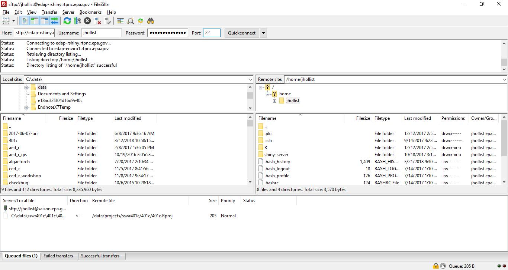
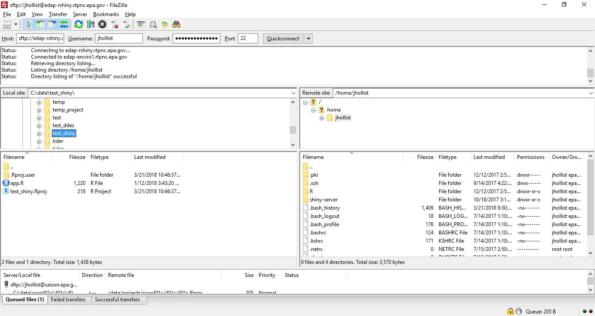
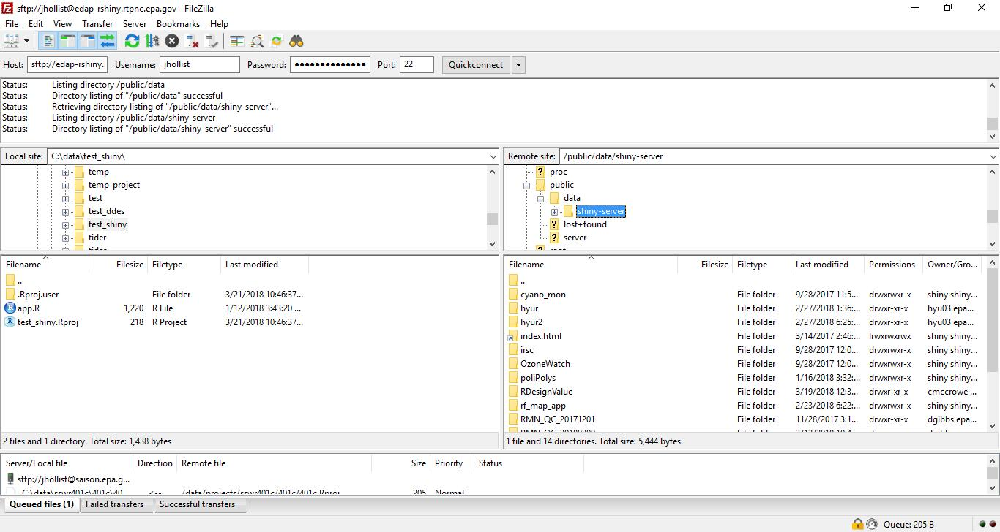
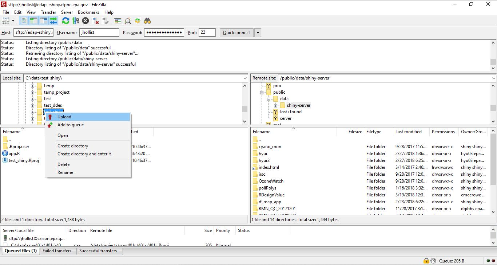
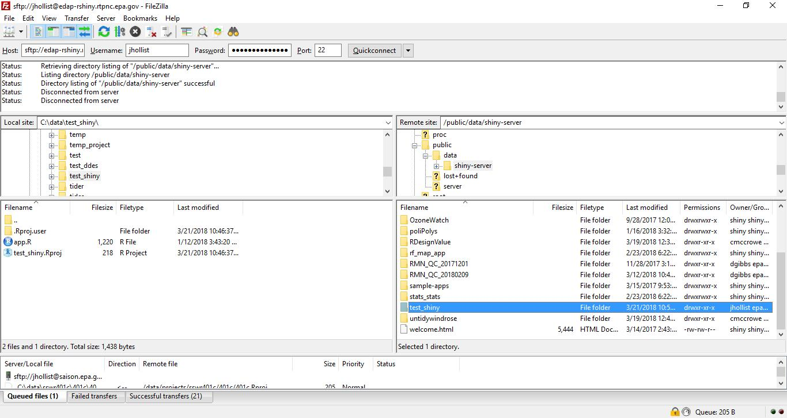

# Shiny Instructions

This document lays out the steps to request a new shiny app on the NCC Shiny Server as well as provides direction on how to move your application files over to the server via FileZilla.

These instructions assume you have developed and tested your shiny app locally and are ready to create a new app on the Shiny server at the NCC in RTP.  Once succesfully set-up these apps will be available to any users on the EPA network.  The process for making apps publically available has not yet been developed and currently this is not available to us.  We plan to address this in the coming months and will hopefully have a process completed in late 2018.

- [Request a new app](#request-a-new-app)
- [Move files to the Shiny server](#move-files-to-the-server)

## Request a new app

Once your app is working locally and ready to be moved to the NCC Shiny Server you will need to request access to the server.  To do so:

1. Send an email to analytics@epa.gov to let them know you have a Shiny app you want to put on the Shiny server.  They need to provide you access.  Make sure to cc vega.ann@epa.gov on this email.
2. In the email, include a list of all R packages needed to run your Shiny app. Request that they be installed on the server.

Once you have been granted access to the server and all the packages you requested have been installed, you will receive an email with next steps.  The most important of which will be moving your application files to the server.

## Move files to the Shiny server

If you have not worked much with remote linux servers, then the process for getting your files moved will seem a bit foreign.  The instructions below should help.

There are many ways to access remote servers from our Windows machines, but the most straightforward method is to use a Windows application, FileZilla, to make the connection to the server and move your application files.  The following instructions explain how to do this.

1. You will need to have FileZilla installed on your machine.  This can be accomplished with the typical Freeware/Shareware request.  

2. With FileZilla installed you can now move your files.  Open up FileZilla.  It will look like this when you do:

3. To connect to the server you may either use the IP address or the hostname.  These are:

  - Hostname:  edap-rshiny.rtpnc.epa.gov
  - IP Address:  134.67.224.125
  
We will use the host name for the rest of these examples. At the top of the FileZilla window you will see a line looking for Host, Username, Password, and Port.  The hostname goes in "Host", your EPA LAN username goes into "Username", your EPA LAN password goes into "Password", and the number 22 goes into "Port".  This is the port typically used by computers for secure File Transfer Protocol.  Click on the Quickconnect button and you **should** see the something like the following:

4. Now that you are connected you can browse to your files on your local machine (i.e. your Windows machine) and browse the location you want to place those files on the remote machine (i.e. the NCC Shiny Server).  You will notice the left side has the directory structure for you local machine and right side has the directory structure for the server.  On the left side browse to the location of the local version of your Shiny app.  For example:

Then on the right side you want to browse to `/public/data/shiny-server`.  You can do this by clicking on the `/` at the top of the directory structure, then browse to `public`, then `data`, then `shiny-server`.  It should look something like:

5. We should be all set to upload files now.  The easiest way is to select the directory that holds your app, in the example this is `test_shiny`, right click on that folder and select "Upload".  

When you do this FileZilla will move the entire folder to the NCC Shiny server.  You should now see on the right side your folder in `/public/data/shiny-server`.  

6. Assuming this all worked, all the required packages were loaded to the server, and your app was written without any hard coded file paths it should work and the app will be available at `http://edap-rshiny.rtpnc.epa.gov:3838/your_app_folder/`.  So for our example, we can access the test_shiny app at <http://edap-rshiny.rtpnc.epa.gov:3838/test_shiny/>.

