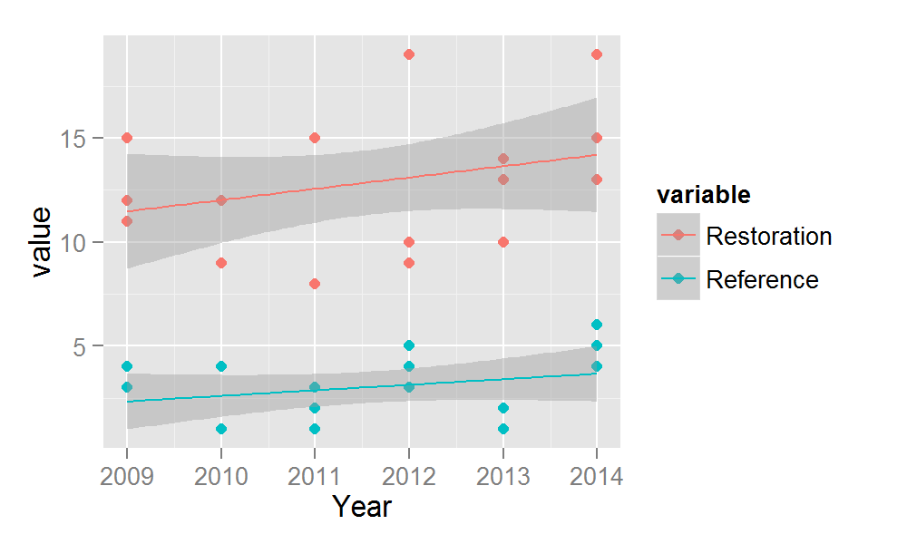

======================
Here's a report I made for my_data_2
----------------------

### Model summary
<!-- html table generated in R 3.1.0 by xtable 1.7-1 package -->
<!-- Mon May 19 16:33:13 2014 -->
<TABLE border=1>
<TR> <TH>  </TH> <TH> Estimate </TH> <TH> Std. Error </TH> <TH> t value </TH> <TH> Pr(&gt |t|) </TH>  </TR>
  <TR> <TD align="right"> (Intercept) </TD> <TD align="right"> -801.35 </TD> <TD align="right"> 475.10 </TD> <TD align="right"> -1.69 </TD> <TD align="right"> 0.10 </TD> </TR>
  <TR> <TD align="right"> variableReference </TD> <TD align="right"> -9.83 </TD> <TD align="right"> 0.81 </TD> <TD align="right"> -12.19 </TD> <TD align="right"> 0.00 </TD> </TR>
  <TR> <TD align="right"> Year </TD> <TD align="right"> 0.40 </TD> <TD align="right"> 0.24 </TD> <TD align="right"> 1.71 </TD> <TD align="right"> 0.10 </TD> </TR>
   </TABLE>

### Figure of restoration and reference by year
 

