## To cover

- facet_wrap, facet_grid
- themes, preset and custom
- ggmap
- ggally

What can you do w/ ggplot2 that you can't do w/ base functions?

---

## R Code Chunk Example

- Facetting is one of the more powerful aspects of ggplot2

- plot y vs x (or just x) by z, where z is some categorical variable

- facet_grid or facet_wrap


```r
data(diamonds)
head(diamonds)
```

```
##   carat       cut color clarity depth table price    x    y    z
## 1  0.23     Ideal     E     SI2  61.5    55   326 3.95 3.98 2.43
## 2  0.21   Premium     E     SI1  59.8    61   326 3.89 3.84 2.31
## 3  0.23      Good     E     VS1  56.9    65   327 4.05 4.07 2.31
## 4  0.29   Premium     I     VS2  62.4    58   334 4.20 4.23 2.63
## 5  0.31      Good     J     SI2  63.3    58   335 4.34 4.35 2.75
## 6  0.24 Very Good     J    VVS2  62.8    57   336 3.94 3.96 2.48
```

---&twocol w1:50% w2:50%

## Simple scatterplot 

***=left

```r
p1 <- ggplot(diamonds, aes(x = carat, 
		y = price)) +
	geom_point()
p1
```

***=right


---&twocol w1:50% w2:50%

## Simple scatterplot with facet_wrap

***=left


```r
p1 + facet_wrap(~color)
```

A simple scatterplot of diamond price by carat, <code>facet_wrap</code> by color

***=right

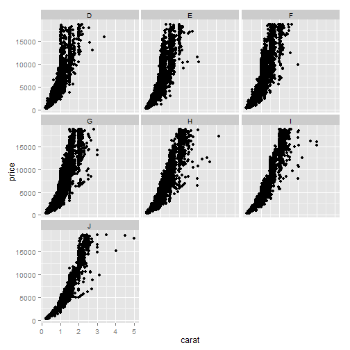

---&twocol w1:50% w2:50%

## Simple scatterplot with facet_grid

***=left


```r
p1 + facet_grid(~color)
```

A simple scatterplot of diamond price by carat, <code>facet_grid</code> by color

What's the difference?

***=right

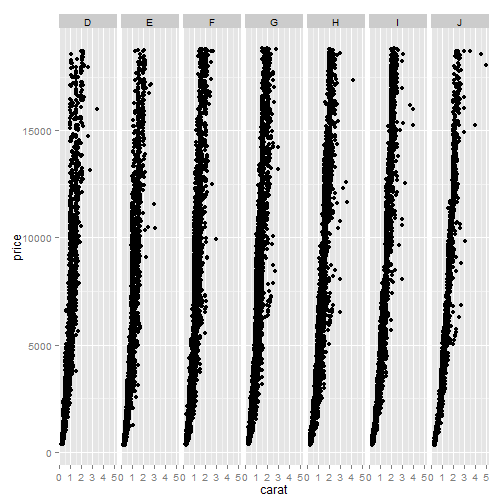

---

## facet_wrap vs facet_grid

- more important for multiple facet variables
- <code>facet_wrap</code> always has one horizontal facet label on the top


```r
p1 + facet_wrap(~ cut + color)
```


---

## facet_wrap vs facet_grid

- more important for multiple facet variables
- <code>facet_grid</code> can have both horizontal, vertical facet labels


```r
p1 + facet_grid(cut ~ color)
```

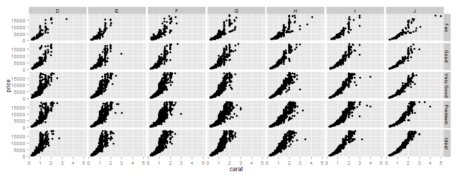

---

## facet_wrap vs facet_grid

- order of variables affects position of facets
- <code>facet_wrap</code> orders facets by position in the call


```r
p1 + facet_wrap(~ color + cut) # same as facet_wrap(color ~ cut)
```

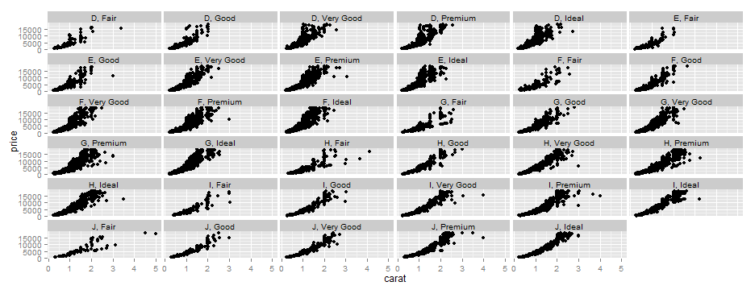

---

## facet_wrap vs facet_grid

- order of variables affects position of facets
- <code>facet_wrap</code> orders facets by position in the call


```r
p1 + facet_wrap(~ cut + color) # same as facet_wrap(cut ~ color)
```

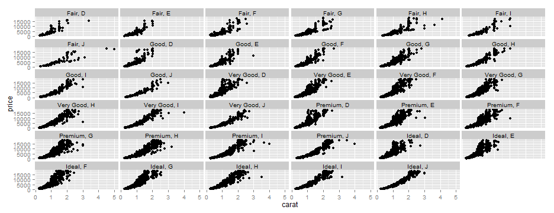

---

## facet_wrap vs facet_grid

- order of variables affects position of facets
- <code>facet_grid</code> orders vertical/horizontal facets by left/right of tilde


```r
p1 + facet_grid(cut ~ color) # not the same as facet_grid(~ cut + color)
```


---

## facet_wrap vs facet_grid

- order of variables affects position of facets
- <code>facet_grid</code> orders vertical/horizontal facets by left/right of tilde


```r
p1 + facet_grid(color ~ cut) # not the same as facet_grid(~ color + cut)
```

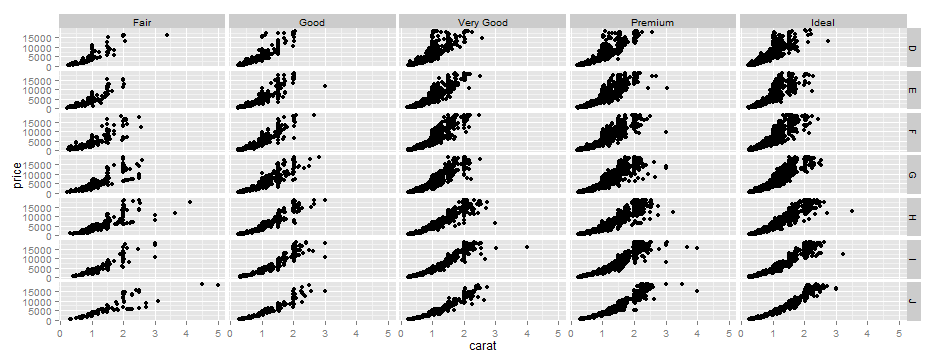

---

## facet_wrap vs facet_grid

- both use the <code>scales</code> argument for axes, otherwise fixed


```r
p1 + facet_wrap(~ color + cut, scales = 'free') # or 'free_x', 'free_y' 
```

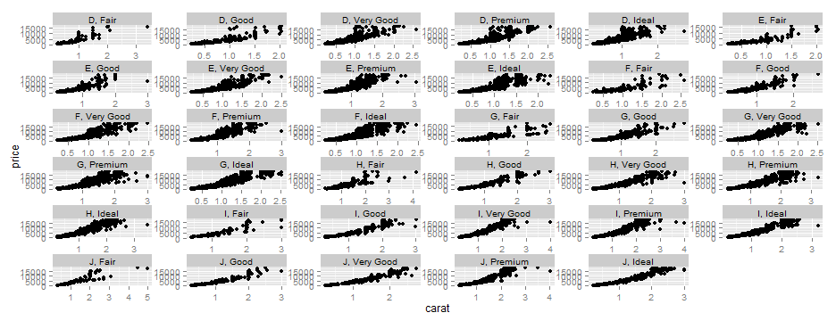

---

## facet_wrap vs facet_grid

- <code>facet_grid</code> treats <code>scales</code> differently


```r
p1 + facet_grid(color ~ cut, scales = 'free') # or 'free_x', 'free_y' 
```

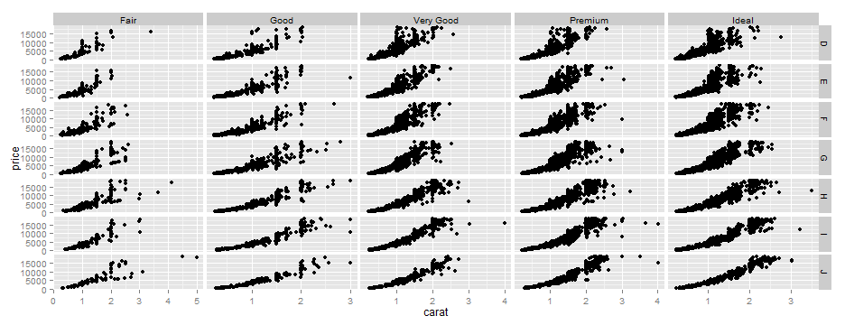


---

## facet_wrap vs facet_grid

- <code>facet_wrap</code> uses the <code>ncol</code> argument


```r
p1 + facet_wrap(~ color + cut, ncol = 7)
```

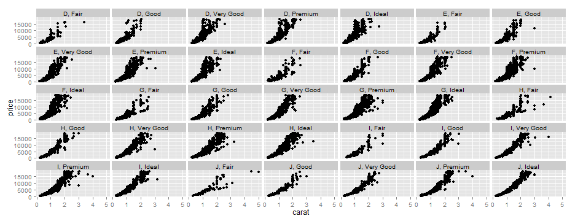

---

## facet_wrap vs facet_grid

- <code>facet_grid</code> always creates a symmetrical plot


```r
p1 + facet_grid(~ color + cut)
```

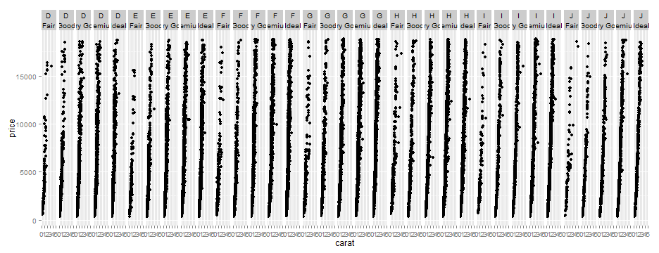

---

## A huge advantage of facets...

- Very easy to quickly evaluate a variable by multiple categories
- Adding some fake variables to diamonds...

```r
diamonds$fake1 <- sample(c('A', 'B'), nrow(diamonds), replace = T)
diamonds$fake2 <- sample(c('C', 'D'), nrow(diamonds), replace = T)
diamonds$fake3 <- sample(c('E', 'F'), nrow(diamonds), replace = T)
diamonds$fake4 <- sample(c('G', 'H'), nrow(diamonds), replace = T)
head(diamonds[, grep('fake', names(diamonds))])
```

```
##   fake1 fake2 fake3 fake4
## 1     B     C     E     G
## 2     B     D     F     H
## 3     A     D     F     G
## 4     B     D     E     G
## 5     A     D     F     G
## 6     B     D     E     H
```


---

## A huge advantage of facets...


```r
p1 + facet_grid(fake1 + fake2 ~ fake3 + fake4)
```

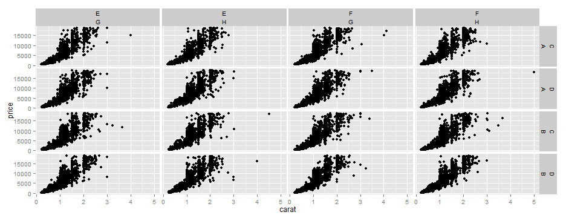

---

## Facet summary

<code>facet_wrap</code> and <code>facet_grid</code> accomplish similar tasks, with slight differences

<code>facet_wrap</code>
- only horizontal facet labels
- not symmetric, uses <code>ncol</code>
- scales affect all facets

<code>facet_grid</code>
- horizontal/vertical facet labels
- always symmetric
- scales only affect outer facets 

 - Not apparent why you would use one over the other...

---&twocol w1:50% w2:50%

## Themes

***=left

- ggplot2 creates plots with a given theme, default is <code>theme_grey()</code>


```r
data(iris)
p2 <- ggplot(iris, aes(x = Sepal.Length, 
		y = Sepal.Width, 
		colour = Species)) +
	geom_point()
p2
```

***=right


---&twocol w1:50% w2:50%

## Themes

***=left

- Other pre-loaded themes are <code>theme_bw()</code> and...


```r
p2 + theme_bw()	
```

***=right

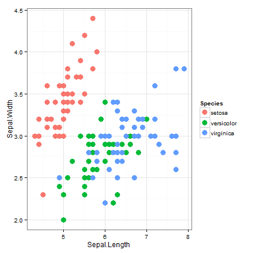

---&twocol w1:50% w2:50%

## Themes

***=left

- <code>theme_classic()</code>


```r
p2 + theme_classic()	
```

***=right

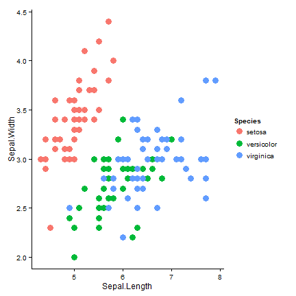

---

## Themes

- Themes are simply complete calls to the <code>ggplot2::theme</code> function
- A custom theme is easily made


```r
ugly_theme <- theme(
	panel.background = element_rect(fill = "green"), 
	axis.line = element_line(size = 3, colour = "red", linetype = "dotted"),
	axis.text = element_text(colour = "blue"),
	axis.ticks.length = unit(.85, "cm")
	)
```

- Complete list of theme options <a href = http://docs.ggplot2.org/current/theme.html>here</a>

---&twocol w1:50% w2:50%

## Themes

***=left

- Great success!


```r
p2 + ugly_theme
```

***=right

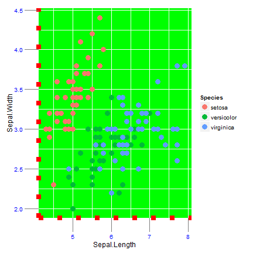

---

## Themes

- The user-defined theme can also be set as default by updating an existing theme


```r
ugly_default <- function(){
	theme_grey() %+replace%
	theme(
		panel.background = element_rect(fill = "green"), 
		axis.line = element_line(size = 3, colour = "red", linetype = "dotted"),
		axis.text = element_text(colour = "blue"),
		axis.ticks.length = unit(.85, "cm")
		)
	}
theme_set(ugly_default())

p2
```


---

## Themes

- The ggthemes library provides additional themes


```r
library(devtools)
install_github('ggthemes', username = 'jrnold')
library(ggthemes)	
```

- Check the <a href = https://github.com/jrnold/ggthemes>repo</a> on Github for more info

---&twocol w1:50% w2:50%

## Themes

***=left

- The ggthemes library provides additional themes
- Wall Street Journal theme


```r
p2 + theme_wsj()
```

***=right

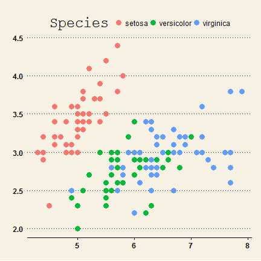

---&twocol w1:50% w2:50%

## Themes

***=left

- The ggthemes library provides additional themes
- Google docs theme


```r
p2 + theme_gdocs()
```

***=right

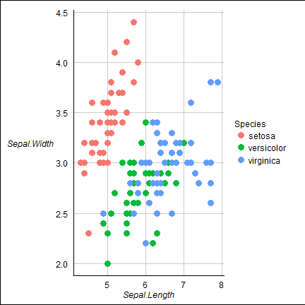

---&twocol w1:50% w2:50%

## Themes

***=left

- The ggthemes library provides additional themes
- Even this old school Excel theme...


```r
p2 + theme_excel()
```

***=right


---

## Easy mapping with ggmap


<q><font size="6">The basic idea of ggmap is to take a downloaded map image, plot it as a context layer using ggplot2, and then plot additional content layers of data, statistics, or models on top of the map.</font></q>

<div align="right"><a href = "http://journal.r-project.org/archive/2013-1/kahle-wickham.pdf">Kahle and Wickham 2011</a></div>

---

## Easy mapping with ggmap

- install/load ggmap
- download the images and format for plotting, done with <code>get_map</code>


```r
install.packages('ggmap')
library(ggmap)

# get map by location
loc <- 'Environmental Protection Agency, 1 Sabine Drive, Gulf Breeze, FL'
my_map <- get_map(
	location = loc, 
	source = 'google', 
	maptype = 'terrain', 
	zoom = 13
	)
```


---&twocol w1:50% w2:50%

## Easy mapping with ggmap

***=left

- plot with <code>ggmap</code>


```r
ggmap(my_map, extent = 'panel')
```

***=right


---&twocol w1:50% w2:50%

## Easy mapping with ggmap

***=left

- Now add some regular ggplot2 content layers


```r
pts <- data.frame(
	lon = c(-87.1930, -87.2050, -87.1571),
	lat = c(30.3473, 30.3406, 30.3380),
	lab = c('Site 1', 'Site 2', 'Home')
	)
ggmap(my_map, extent = 'panel',
	base_layer = ggplot(pts, 
			aes(x = lon, y = lat))) +
		geom_text(aes(label = lab))
```

***=right

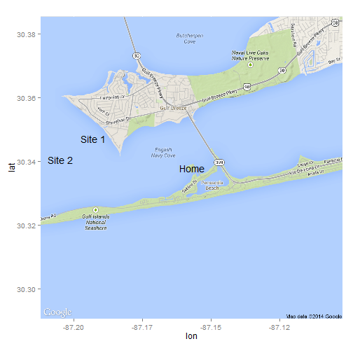

---&twocol w1:50% w2:50%

## Easy mapping with ggmap

***=left

- Additional map types
- See <a href = http://cran.r-project.org/web/packages/ggmap/ggmap.pdf>documentation</a> for full list of options


```r
my_map <- get_map(
	location = loc, 
	source = 'google', 
	maptype = 'satellite', 
	zoom = 13
	)
ggmap(my_map, extent = 'panel')
```

***=right

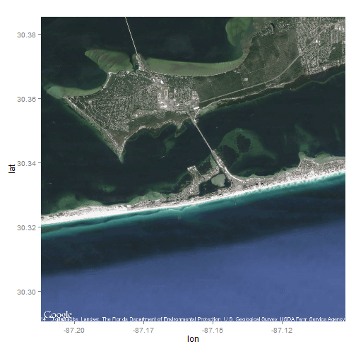

---&twocol w1:50% w2:50%

## GGally

***=left

- A helper to ggplot2... contains templates for different plots to be combined into a plot matrix, a parallel coordinate plot function, as well as a function for making a network plot, on <a href = http://cran.r-project.org/web/packages/GGally/GGally.pdf>CRAN</a>
- The <a href=http://vita.had.co.nz/papers/gpp.pdf>generalized pairs plot</a> is a plot matrix that builds on the standard pairs plot


```r
data(tips, package = "reshape2")
pairs(tips[, 1:4])
```

***=right

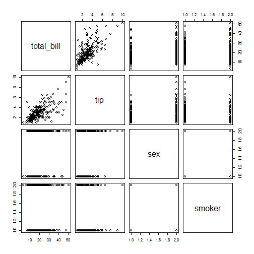

---&twocol w1:50% w2:50%

## GGally

***=left

- Pairs plots are inadequate for exploratory analysis of variables that are a mix of quantitative and categorical information
- ggpairs provides a plot matrix of mosaic tiles that describe data of different categories using a ggplot2 framework


```r
install.packages('GGally')
ggpairs(tips[, 1:4])
```

***=right

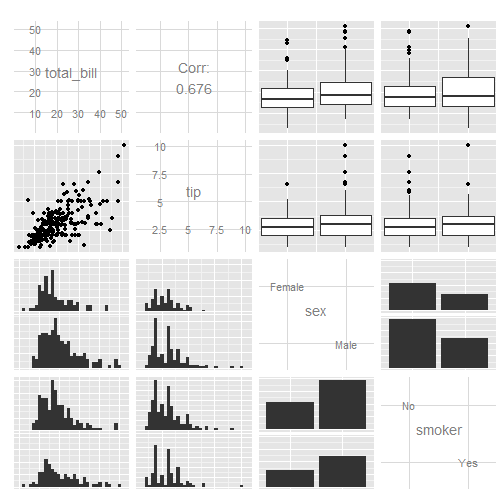

---&twocol w1:50% w2:50%

## GGally

***=left

- Information above/below diagonal is not redundant
- quantitative-quantitative: scatterplot
- quantitative-categorical: boxplots
- categorical-categorical: conditional barplots


```r
install.packages('GGally')
ggpairs(tips[, 1:4])
```

***=right


---&twocol w1:50% w2:50%

## GGally

***=left

- Defaults can be customized


```r
install.packages('GGally')
ggpairs(
  tips[,1:4],
  upper = list(continuous = "density", 
  	combo = "box"),
  lower = list(continuous = "points", 
  	combo = "dot")
	)
```

***=right

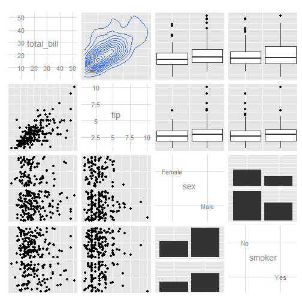

---&twocol w1:50% w2:50%

## GGally

***=left

- Other plots... static parallel coordinate plots.


```r
ggparcoord(data = iris, columns = 1:4, 
	groupColumn = 5, 
	order = "anyClass")
```

***=right

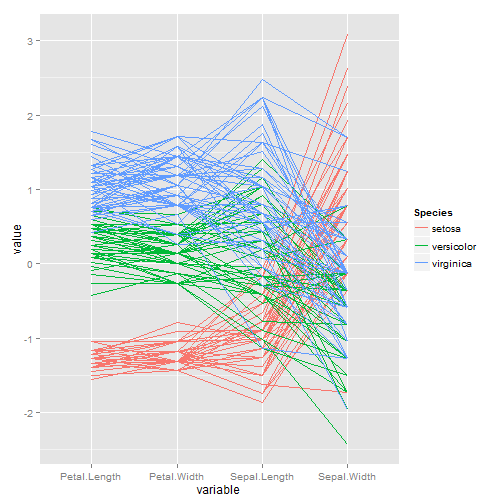

---&twocol w1:50% w2:50%

## GGally

***=left

- Other plots... network plots.


```r
library(sna)

url = url("http://networkdata.ics.uci.edu/
	netdata/data/cities.RData")
print(load(url)); close(url)
# plot cities, firms and law firms
type = cities %v% "type"
type = ifelse(grepl("City|Law", type), 
	gsub("I+", "", type), "Firm")
ggnet(cities, mode = "kamadakawai", 
	alpha = .5, node.group = type, 
	label.nodes = c("Paris", "Beijing", 
		"Chicago"), 
	color = "darkred")
```

***=right

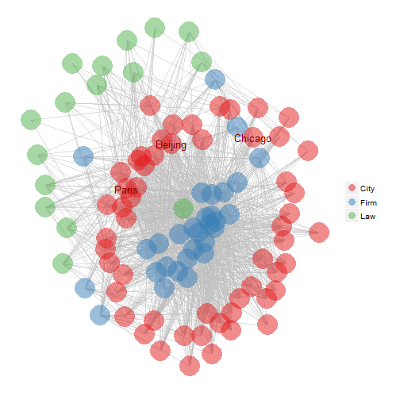

---

## What does ggplot2 offer that isn't in base?

- Many geoms

```r
ls(pattern = '^geom_', env = as.environment('package:ggplot2'))
```

```
##  [1] "geom_abline"     "geom_area"       "geom_bar"       
##  [4] "geom_bin2d"      "geom_blank"      "geom_boxplot"   
##  [7] "geom_contour"    "geom_crossbar"   "geom_density"   
## [10] "geom_density2d"  "geom_dotplot"    "geom_errorbar"  
## [13] "geom_errorbarh"  "geom_freqpoly"   "geom_hex"       
## [16] "geom_histogram"  "geom_hline"      "geom_jitter"    
## [19] "geom_line"       "geom_linerange"  "geom_map"       
## [22] "geom_path"       "geom_point"      "geom_pointrange"
## [25] "geom_polygon"    "geom_quantile"   "geom_raster"    
## [28] "geom_rect"       "geom_ribbon"     "geom_rug"       
## [31] "geom_segment"    "geom_smooth"     "geom_step"      
## [34] "geom_text"       "geom_tile"       "geom_violin"    
## [37] "geom_vline"
```

---

## What does ggplot2 offer that isn't in base?

- Easy facetting, pre-loaded and customized themes, spatial data, pairs plots...

- See online <a href = http://ggplot2.org/>documentation</a> for additional functionality

- Presentation materials available <a href = https://github.com/fawda123/ggpres_102>here</a>

- EPA, NHEERL slidify template from Jeff's <a href = https://github.com/jhollist/jwhSlidifyStyle>repo</a>
